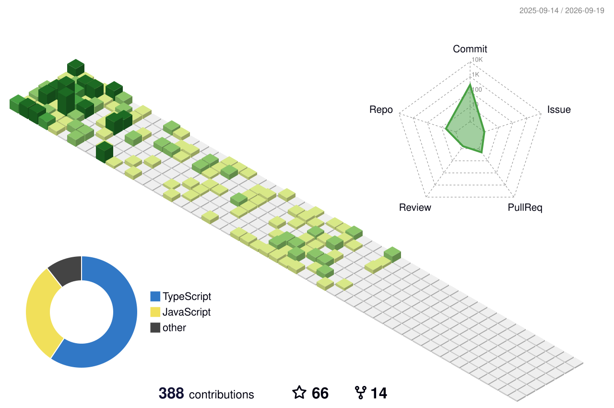

  🚀 Frontend / Full Stack Developer  
  🔥 Currently focused on mastering JavaScript, React, and backend fundamentals  
  🧠 On a mission to become the best version of myself — technically & personally

  

  💻 React + Node.js. Full Stack and fully focused.  
  🧠 DSA grind. Code that actually solves.  
  🎯 Eyes on open source and global opportunities.  
  🧘 Calm head. Sharp execution. No excuses.

---

### 🛠️ Tech Stack I Use & Love  

  From pixels to APIs — tools I build with daily

<table align="center">
  <!-- Row 1: Frontend Frameworks -->
  <tr>
    <td></td>
    <td align="center"> React.js</td>
    <td align="center"> Next.js</td>
    <td align="center"> TypeScript</td>
    <td align="center"> Vue.js</td>
    <td align="center"> Angular</td>
    <td></td>
  </tr>

  <!-- Row 2: Styling + Backend + DB -->
  <tr>
    <td align="center"> JavaScript</td>
    <td align="center"> Tailwind</td>
    <td align="center"> Node.js</td>
    <td align="center"> Express</td>
    <td align="center"> MongoDB</td>
    <td align="center"> PostgreSQL</td>
    <td align="center"> MySQL</td>
  </tr>

  <!-- Row 3: Bonus/DevOps/Testing -->
  <tr>
    <td align="center"> Jest</td>
    <td align="center"> Linux</td>
    <td align="center"> Postman</td>
    <td align="center"> Firebase</td>
    <td align="center"> Vercel</td>
    <td align="center"> Bash</td>
    <td align="center"> ESLint</td>
  </tr>
  <!-- Row 4: Tools, Infra -->
  <tr>
    <td></td>
    <td align="center"> Prisma</td>
    <td align="center"> Docker</td>
    <td align="center"> Git</td>
    <td align="center"> GitHub</td>
    <td align="center"> Figma</td>
    <td></td>
  </tr>

</table>

### 📊 GitHub Stats

<table align="center">
  <tr>
    <!-- GitHub Stats -->
    <td width="50%">
      
    </td>
    <!-- Streak Stats -->
    <td width="50%">
      
    </td>
  </tr>
</table>

  

---

### 🔗 Connect with Me

  
  
  
  
   

  

